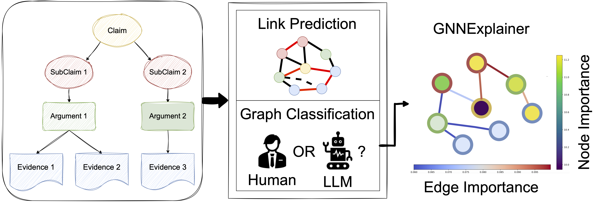
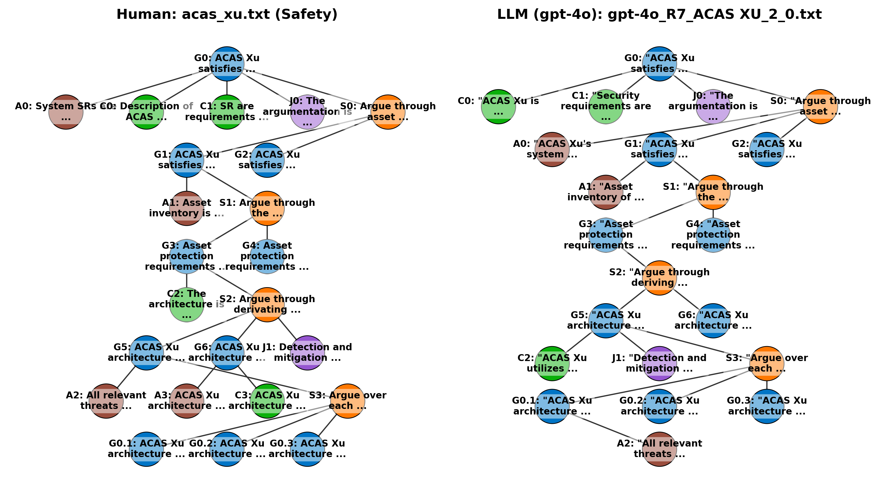

<!-- # assuregraph
Assurance Cases as Text-Attributed Graphs -->

# AssureGraph: Graph-Based Evaluation of Human vs LLM-Generated Assurance Cases

This repository contains the official implementation of the paper:

> **Evaluation of LLM-Generated Assurance Cases through Argument Graph Analysis**  
> (Under review)

AssureGraph introduces a **graph evaluation framework** for analysing the structural quality, provenance, and reasoning patterns of *assurance cases*. These are structured argument documents used in safety, security, and regulatory compliance.

We model assurance cases as **Text-Attributed Argument Graphs (TAGs)** and evaluate them using **Graph Neural Networks (GNNs)** for:

- **Link Prediction** — inferring missing or incorrect reasoning links  
- **Graph Classification** — distinguishing between *human-authored* and *LLM-generated* cases  
- **Explainability** — analysing node/edge importance using GNNExplainer  

This repository provides:
- A cleaned and curated **public dataset** of assurance cases  
- Scripts for **graph construction, training, and evaluation**  
- Reproducible experiments for **link prediction**, **provenance classification**, and **GNN explainability**  
- Utilities to visualise structural differences between human and LLM-generated cases  


---

## 🔍 Background

Assurance cases (CAE, GSN, Safety Trees) are widely used to justify safety/security properties of critical systems such as aircraft, software platforms, and machine learning components.

Recent work attempts to **automatically generate assurance cases using LLMs**, but this introduces risks:
- Missing or incorrect links  
- Incorrect hierarchical structure  
- Over-simplified or over-connected arguments  
- Lack of traceability  

To address these problems, this repository builds a graph-based analysis framework to evaluate the structural fidelity and reasoning consistency of assurance cases from different sources.

---

## 📊 Overview of the Framework

<p align="center">
  
</p>

---

## 🧠 Methodology

### 1. Text-Attributed Argument Graphs (TAGs)

Each assurance case is transformed into a graph:

- **Nodes:** textual elements (Goal, Claim, Argument, Evidence, Context…)  
- **Edges:** support or dependency links  
- **Node Features:** BERT embeddings of textual content  

This representation enables GNNs to reason jointly over structure and semantics.

---

### 2. Tasks

#### **🧩 Link Prediction**
Recover missing or incorrect links between nodes.

We evaluate:
- **Human → Human**
- **LLM → Human** (cross-provenance)
- **Human+LLM → Human** (semi-supervised)

#### **📦 Graph Classification (Human vs LLM)**
Detect bias by classifying whether a graph was authored by a human or generated by an LLM.

<p align="center">
  
</p>

The figure illustrates the *structural differences* between a human-authored assurance case and one generated by GPT-4o. These differences motivate the need for graph-based reasoning and bias detection.

#### **🔎 Explainability**
We apply:
- **GNNExplainer**
- **Fidelity / Unfaithfulness metrics**
- **Node vs Edge importance analysis**

This reveals whether GNN decisions rely on structure, semantics, or spurious shortcuts.

---

## 📚 Dataset

We include three types of assurance-case datasets:

| Dataset | Source | Style | Provenance | #Graphs |
|--------|--------|--------|-------------|---------|
| Safety Trees | Agrawal et al. (2019) | Tree | Human | 39 |
| GSN-1 | Sivakumar et al. | Graph | Human + GPT-4o | 34 |
| GSN-2 | Odu et al. | Graph | Human + GPT-4o | 190 |

All datasets are converted into node/edge JSON.

---

## 🛠️ Installation

```bash
git clone https://anonymous.4open.science/r/assuregraph-B6BB
cd assuregraph
pip install -r requirements.txt

